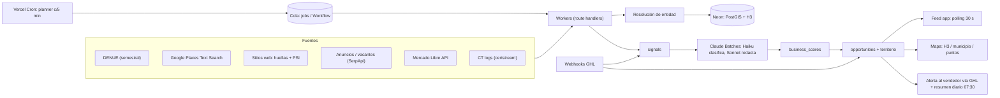

# Prospección en tiempo real y mapa nacional: señales, arquitectura y roadmap

> Fecha: 2026-10-08 · Alcance: señales disparadoras, enriquecimiento con LLM, arquitectura, mapa y roadmap.
> Las fuentes base (DENUE, Google Places, OSM, directorios) y el marco legal están en [`fuentes-de-datos-mexico.md`](./fuentes-de-datos-mexico.md); aquí solo se citan. Supuesto: **DENUE es el universo base de negocios**.
> Precios en USD, verificados en la fecha indicada; lo que no se pudo confirmar dice **"por verificar"**.

## 0. Resumen ejecutivo

1. **"Tiempo real" realista = escalonado.** Segundos/minutos para nuestras propias interacciones (webhooks de GHL); menos de 24 h para señales públicas de cuentas "calientes"; semanas para descubrir negocios nuevos. Ninguna fuente pública manda avisos push del tipo "este negocio tiene un problema": todo lo externo se consulta periódicamente (polling), así que el límite es el **costo de cada actualización**.
2. **La señal más valiosa es el dolor exacto**: reseñas que dicen "no contestan", "nunca me regresaron la llamada". La API de Places solo da **5 reseñas por lugar, ordenadas por relevancia y sin la respuesta del dueño**, así que es una muestra, no un monitoreo completo.
3. **Publicidad:** la Meta Ad Library API **no sirve en México** (fuera de la UE solo devuelve anuncios políticos/sociales). El sustituto barato y legal es detectar el **Meta Pixel o la etiqueta de Google Ads en el sitio del negocio**.
4. **Claude es barato frente a Google.** Enriquecer, clasificar y redactar para 1,000 negocios cuesta **≈ US$2.7 con Message Batches** (≈ US$5.4 sin batch). Google Places Text Search Enterprise + Atmosphere cuesta US$40 por 1,000 solicitudes.
5. **Arquitectura:** Vercel Cron como planificador, una cola durable (primero una tabla `jobs` en Postgres; después Vercel Workflow), PostGIS + H3 en Neon (ambos soportados) y un feed por polling de 30 s más alertas al vendedor vía GHL.
6. **Mapa:** MapLibre GL + PMTiles (Protomaps) u OpenFreeMap, con agregación H3/municipio y puntos solo a zoom alto. No usar los tiles públicos de OSM en producción.

### Hallazgos del código actual (sin modificarlo)

| Hallazgo | Dónde | Impacto |
|---|---|---|
| Con `places.reviews` encendido (es lo predeterminado; `PLACES_ACTIVITY_SIGNAL=off` lo quita, según el árbol de trabajo en curso), **cada página** de Text Search se cobra como *Enterprise + Atmosphere* (US$40/1,000 tras 1,000 gratis) | `src/lib/places.ts` | Hasta 60 resultados = 3 solicitudes ≈ US$0.12 por búsqueda |
| La caché de búsquedas ya no guarda resultados de Google, pero **al guardar un prospecto** `INSERT INTO leads` sí persiste `rating`, `review_count`, `last_review`, `phone`, `website` y `lat/lon` | `src/lib/leads-repo.ts` | Las políticas de Places solo permiten guardar `place_id` indefinidamente; lat/lng hasta 30 días ([políticas](https://developers.google.com/maps/documentation/places/web-service/policies), [términos 2025](https://cloud.google.com/archive/maps-platform/terms/maps-service-terms-20250501)) |
| Resultados de Google pintados sobre Leaflet con tiles OSM | `src/components/LeadsMap.tsx` | Los términos específicos de Places traen la cláusula "No use with a non-Google map" (§5.3 en versiones 2018–2025; **por verificar** en la versión vigente) |
| Tiles `{s}.tile.openstreetmap.org` y Nominatim públicos | `LeadsMap.tsx`, `osm.ts`, `api/reverse` | La [política de tiles](https://operations.osmfoundation.org/policies/tiles/) prohíbe uso pesado o precarga y no ofrece SLA; [Nominatim](https://operations.osmfoundation.org/policies/nominatim/) permite máximo 1 req/s |
| Dedupe por `nombre|ciudad` y score calculado en el navegador | `dedupe.ts`, `page.tsx` | Duplicados entre fuentes; score sin versión ni historial |

---

## 1. Tiempo real y catálogo de señales

### 1.1 Qué es realista

| Latencia | Mecanismo | Ejemplos | Costo |
|---|---|---|---|
| **Segundos–minutos** | Push (webhooks, streams) | GHL `InboundMessage`, `AppointmentCreate`, `LCEmailStats`; formularios propios; logs de Certificate Transparency | ~US$0 |
| **Horas (<24 h)** | Polling diario sobre la cuenta caliente (top ~2–5k) | Reseñas nuevas, anuncios, vacantes, cambios del sitio | Lineal en número de cuentas × frecuencia |
| **Días–semanas** | Barridos por municipio × giro | Lugares nuevos en Google, inventario en Mercado Libre | Ver §5 |
| **Meses** | Ediciones censales | DENUE 05/2026 (~6.14 M establecimientos); próxima publicación **25-nov-2026** ([boletín INEGI](https://www.inegi.org.mx/contenidos/saladeprensa/boletines/2026/denue/DENUE2026_05.pdf)) | US$0 |

**Regla de refresco por temperatura:** calientes (score ≥ 70 o con señal en los últimos 14 días) se actualizan diario; tibias (40–69) semanal; frías mensual; DENUE en cada edición. Así "tiempo real" significa que la oportunidad llega al feed del vendedor **dentro de la ventana útil del disparador**.

### 1.2 Catálogo priorizado

Peso = puntos sugeridos para el componente indicado (ver fórmula en §1.3).

| # | Señal | Qué indica | Cómo se obtiene | Frecuencia | Costo | Riesgo ToS/legal | Peso |
|---|---|---|---|---|---|---|---|
| 1 | **Reseñas con dolor de atención/seguimiento** ("no contestan", "no responden el WhatsApp", "nunca me regresaron la llamada") | Exactamente el problema que resuelve AI Lead Shield | Places `reviews`: **máx. 5, "sorted by relevance"**, campos `text`, `rating` y `publishTime`; **sin respuesta del dueño** ([referencia](https://developers.google.com/maps/documentation/places/web-service/reference/rest/v1/places)). Las clasifica Haiku (§2) | Diario (calientes) / mensual | Va incluida si ya se pide en Text Search (US$40/1,000 req); Place Details Ent+Atm US$25/1,000 ([precios](https://developers.google.com/maps/billing-and-pricing/pricing)) | **Medio-alto**: no guardar el texto; guardar solo la categoría derivada (que esto sea "contenido derivado" permitido está **por verificar**) | Intención +20 (1 queja < 90 d); +30 (≥ 2) |
| 2 | **Anuncios activos detectados en el sitio** (Meta Pixel `fbq(`, Google Ads `AW-`, GTM, TikTok pixel) | Paga por adquirir leads y necesita atenderlos rápido | Fetch propio del HTML más las huellas de [enthec/webappanalyzer](https://github.com/enthec/webappanalyzer) (fork abierto de Wappalyzer) | Al rastrear (mensual) | ~US$0 | Bajo (respetar robots.txt, 1 req/s por dominio) | Intención +10 |
| 3 | **Anuncios en bibliotecas públicas** | Campaña viva hoy | **Meta**: la API solo devuelve anuncios que no llegaron a la UE "if they are about social issues, elections or politics" ([ads_archive](https://developers.facebook.com/docs/graph-api/reference/ads_archive/)), así que **no sirve en MX**; usar un link manual a la [Ad Library](https://www.facebook.com/ads/library/). **Google Ads Transparency**: sin API oficial (el dataset de BigQuery es de anuncios electorales, [blog](https://cloud.google.com/blog/topics/developers-practitioners/how-get-started-political-ads-transparency-report-dataset)); hay un motor de terceros en [SerpApi](https://serpapi.com/blog/scraping-google-ads-transparency-center-with-serpapi-and-node-js/). **TikTok CCL**: solo EEE/UK/CH ([API](https://developers.tiktok.com/products/commercial-content-api)) | Diario (top) | SerpApi US$25–275/mes (precio de terceros, **por verificar** en [serpapi.com/pricing](https://serpapi.com/pricing)) | Medio (el tercero hace scraping) | Intención +15 |
| 4 | **Vacantes de asesor de ventas / call center / community manager** | Crecimiento y cuello de botella en atención | Google Jobs vía SerpApi; la página "bolsa de trabajo" del propio sitio. La API publisher de Indeed está cerrada ([jobspipe](https://jobspipe.dev/blog/indeed-publisher-api)); OCC y Computrabajo no tienen API pública; LinkedIn solo para partners (**por verificar**) | Semanal | SerpApi (mismo plan) | Medio; **alto** si se raspa OCC/Indeed directo | Intención +12 (ventas/atención), +6 (otras) |
| 5 | **Negocio o sucursal nueva** | Está montando su captación | (a) Diferencia de IDs entre ediciones de DENUE; el campo `fecha_alta` del CSV está **por verificar** en 05/2026 ([API DENUE](https://www.inegi.org.mx/servicios/api_denue.html)). (b) Un `place_id` que no aparecía en barridos previos del mismo municipio × giro, con `userRatingCount` bajo | Semestral / semanal (metros) | US$0 / Text Search | Bajo / medio | Intención +10 (vida media 120 d) |
| 6 | **Dominio o sitio nuevo** | Lanzamiento digital | NIC México **no publica archivo de zona ni feed** de altas, y el CZDS de ICANN es para gTLD (**por verificar**; [dominios.mx](https://www.dominios.mx), [CZDS](https://czds.icann.org)). Alternativa: **logs de Certificate Transparency** con [certstream-server-go](https://github.com/d-Rickyy-b/certstream-server-go) propio, filtrando `*.mx`/`*.com.mx` con palabras clave (autos, motors, seminuevos, inmobiliaria, bienesraices, taller, refacciones) | Segundos | ~US$5/mes (VM pequeña) | Bajo | Intención +5 (solo si se empata con un negocio) |
| 7 | **Velocidad de reseñas** | Mucho flujo de clientes, por lo tanto de leads | Delta de `userRatingCount` entre lecturas | Semanal | Text Search | **Medio**: guardar el conteo más de 30 días no está permitido; guardar solo la bandera derivada (**por verificar**) | Intención +5–10 |
| 8 | **% de reseñas respondidas por el dueño** | Calidad de atención | **No disponible** en Places API. La [GBP API](https://developers.google.com/my-business/reference/rest/v4/accounts.locations.reviews/updateReply) solo funciona para el dueño verificado; lo demás es scraping | — | — | Alto (scraping) | 0: descartar o revisión manual |
| 9 | **Inventario en portales** | Volumen de leads entrantes | La API oficial de Mercado Libre requiere token Bearer en sus ejemplos ([items y búsquedas](https://developers.mercadolibre.com.ar/items-y-busquedas)); terceros reportan 403 sin token desde 2025 (**por verificar** con token de app). Inmuebles24 y Seminuevos no tienen API pública conocida | Semanal | US$0 | Bajo con ML; alto si se raspan los demás | Afinidad +5; intención +5–10 según # de anuncios |
| 10 | **Brechas del sitio**: sin `wa.me`/chat, sin formulario, sin HTTPS, caído, PSI móvil < 50, sin CRM (HubSpot/GHL/Zoho/Salesforce) | No captura o no atiende el lead | Fetch propio + [PageSpeed Insights API](https://developers.google.com/speed/docs/insights/v5/get-started) (gratis, ~25k consultas/día) + huellas | Mensual | ~US$0 | Bajo | Intención +5 c/u (máx. +15); chatbot o CRM de la competencia ya instalado −10 en afinidad |
| 11 | **Propias, correo**: apertura, clic, rebote | Interés | GHL `LCEmailStats` / webhooks de Resend | Minutos | US$0 | Bajo | Apertura +2 (poco fiable por Apple MPP); clic +10; rebote duro → invalidar el correo |
| 12 | **Propias, conversación**: respuesta, cita, baja | Intención explícita | GHL `InboundMessage`, `AppointmentCreate`, `OpportunityStatusUpdate`, `ContactDndUpdate` ([lista de 77 eventos](https://marketplace.gohighlevel.com/docs/category/webhook)); firma `X-GHL-Signature` (Ed25519; la RSA legada se depreca el 1-sep-2026); hasta 12 reintentos ([guía](https://marketplace.gohighlevel.com/docs/webhook/WebhookIntegrationGuide)) | Segundos | US$0 | Bajo | Pasa a "respondió"/"cita" **al instante**, fuera del score. DND → lista de supresión |

### 1.3 Fórmula de score (v2, server-side y versionada)

`total (0–100) = afinidad (0–30) + intención (0–50) + contactabilidad (0–20)`

- **Afinidad**: giro objetivo 10; estrato de personal DENUE ≥ 6 → +4, ≥ 11 → +8; presencia digital 0–6; sin herramienta competidora 0–6.
- **Intención**: `Σ peso_i × fuerza_i × 0.5^(edad_días / vida_media_i)`, con tope de 50. Vidas medias: reseñas 45 d, anuncios 14 d, vacantes 30 d, negocio nuevo 120 d, brechas web 180 d.
- **Contactabilidad**: correo verificado 8, móvil/WhatsApp 8, decisor identificado 4.
- **Exclusiones**: `CLOSED_PERMANENTLY`, lista de supresión, ya es cliente, contactado hace menos de 30 días (enfriamiento).
- **Se crea una oportunidad** cuando `total ≥ 60` **y** entra una señal de intención nueva (de menos de 7 días), o siempre que hay respuesta o cita.
- **Fase 3**: recalibrar los pesos con regresión logística sobre resultados (respondió/cita) cuando haya ≥ 300 contactados y ≥ 30 positivos.

---

## 2. Enriquecimiento y scoring con Claude

### 2.1 Tareas y modelos

| Tarea | Modelo | Modo | Entrada / salida |
|---|---|---|---|
| Clasificar el sitio y las 5 reseñas: giro real, cadena o independiente, canales de contacto, chat, dolores `{categoria, evidencia_parafraseada, severidad}`, señales de decisor | `claude-haiku-5-5`, `effort: low`, salida estructurada (`output_config.format` con JSON Schema) | Batch nocturno | Texto visible del sitio ≤ 12k caracteres + reseñas + metadatos → JSON |
| Primer mensaje por canal (correo de 90–120 palabras, WhatsApp ≤ 60), citando la señal concreta sin copiar reseñas | `claude-sonnet-5-5` | Batch para el backlog; **tiempo real** si la señal es caliente | Perfil enriquecido → 2 borradores |
| Cuentas complejas (grupos automotrices multi-sucursal), resumen semanal por territorio, revisión de la rúbrica | `claude-opus-5-5` | Batch semanal | Varias fichas → informe |

**Prompt caching:** el system prompt + rúbrica + 6–10 ejemplos (~1.5–2k tokens) va como prefijo fijo con `cache_control`. El mínimo cacheable en estos modelos es 512 tokens según la guía del SDK (confirmar en la [documentación](https://platform.claude.com/docs/en/build-with-claude/prompt-caching)). La lectura de caché cuesta 0.1× la entrada en Haiku 5.5 y 0.05× en Sonnet 5.5 y Opus 5.5. Los descuentos de caché y de Batch se acumulan. **Batches:** hasta 100k solicitudes o 256 MB por lote; la mayoría termina en < 1 h y el máximo es 24 h ([batch processing](https://platform.claude.com/docs/en/build-with-claude/batch-processing)). Usar `custom_id = business_id`.

### 2.2 Costo por 1,000 negocios

Precios oficiales ([pricing](https://platform.claude.com/docs/en/about-claude/pricing)), por MTok:

| Modelo | Entrada | Salida | Batch entrada / salida | Lectura de caché |
|---|---|---|---|---|
| Haiku 5.5 (prompt ≤ 100k) | $0.10 | $0.50 | $0.05 / $0.25 | $0.01 |
| Sonnet 5.5 | $2 | $10 | $1 / $5 | $0.10 |
| Opus 5.5 | $4 | $20 | $2 / $10 | $0.20 |

| Paso | Volumen | Tokens por negocio (variable / en caché / salida, incluye razonamiento) | Batch | Sin batch |
|---|---|---|---|---|
| Haiku: clasificar | 1,000 | 3,800 / 1,500 / 600 | **$0.35** | $0.70 |
| Sonnet: redactar (top 20%) | 200 | 1,500 / 2,000 / 1,000 | **$1.32** | $2.64 |
| Opus: análisis (top 2%) | 20 | 10,000 / — / 3,000 | **$1.00** | $2.00 |
| **Total** | | | **≈ $2.70** | **≈ $5.35** |

Conviene sumar un margen de +30–50%: el tokenizer de los modelos 4.7 en adelante genera ~30% más tokens y el español es más largo. Para comparar: **una sola** Place Details Ent+Atm cuesta $0.025, casi el doble de lo que cuesta pasar un negocio entero por Claude con batch.

**Salvaguardas:** el texto de sitios y reseñas es **dato no confiable** (inyección de prompt). Va en bloques delimitados, sin herramientas y con salida validada por schema. En las Fases 1–2 ningún mensaje se envía sin aprobación del vendedor. No se guardan nombres de autores de reseñas.

---

## 3. Arquitectura sobre el stack actual

### 3.1 Componentes y elección de cola

- **Planificador**: Vercel Cron en **Pro**. Pro permite hasta 1 ejecución por minuto y 100 crons por proyecto; Hobby solo 1 diaria ([cron](https://vercel.com/docs/cron-jobs/usage-and-pricing)) y además es para uso **no comercial** ([Hobby](https://vercel.com/docs/plans/hobby)). Los crons van en UTC: 07:30 en CDMX = `30 13 * * *` (sin horario de verano desde 2022).
- **Funciones**: Fluid compute con 300 s por defecto y 800 s máximo en Pro ([límites](https://vercel.com/docs/functions/limitations)). Cada job debe ser corto e idempotente.

| Opción | Precio / límites (verificados) | Pros | Contras |
|---|---|---|---|
| **Tabla `jobs` en Neon** (`FOR UPDATE SKIP LOCKED`) + cron cada minuto | US$0 extra | Sin proveedor nuevo; funciona con el driver HTTP de Neon en una sola sentencia | Hay que programar reintentos y backoff; throughput de ~20 jobs/min por invocación |
| **Vercel Queues** | Se cobra por operación en bloques de 4 KiB, con precio regional; Hobby incluye 1 M de operaciones; retención máx. 7 d; visibility timeout máx. 60 min ([pricing](https://vercel.com/docs/queues/pricing)) | Nativa; modo push a funciones | Precio por operación no publicado en tabla (regional) |
| **Vercel Workflow** | Eventos a US$0.02/1k (Hobby incluye 50k); datos a US$0.50/GB ([pricing](https://vercel.com/docs/workflows/pricing)); GA en abril de 2026 según el [digest de la comunidad](https://community.vercel.com/t/vercel-weekly-2026-04-20/38580) (**por verificar**) | Pasos durables, `sleep`, reintentos; corre sobre Queues | Un paso = 3 eventos o más |
| **Upstash QStash** | Free: 1,000 mensajes/día; PAYG US$1 por 100k mensajes, paralelismo 100 ([pricing](https://upstash.com/pricing/qstash)) | Barato; cron y delays incluidos | Cada reintento cuenta como mensaje |
| **Inngest** | Free: 50k ejecuciones/mes y 5 pasos concurrentes; Pro US$99/mes con 1 M ejecuciones y 100 concurrentes ([pricing](https://www.inngest.com/pricing)) | Throttling y concurrencia por llave (útil para la cuota de Google) | Otro proveedor; US$99/mes en cuanto se escala |

**Recomendación:** Fases 0–1 con la tabla `jobs` (costo cero, suficiente para miles de jobs al día). Fase 2 con **Vercel Workflow** para barridos largos y esperas por rate limit. Inngest es la alternativa si el throttling por API se complica.

### 3.2 Flujo



### 3.3 Entidad única y deduplicación

1. **Llaves fuertes**: `denue_id`, `place_id`, `osm_id`, dominio registrable y teléfono E.164.
2. **Coincidencia difusa**: `similarity(name_norm) ≥ 0.6` (pg_trgm), `ST_DWithin(geom, 150 m)` y mismo giro. Si coincide además teléfono o dominio, la confianza pasa de 0.9. Entre 0.6 y 0.9 va a una cola de revisión.
3. La **geometría canónica** sale de DENUE/OSM o del geocodificado propio, nunca de Google (lat/lng de Google solo se puede guardar 30 días).
4. Cadenas y grupos automotrices: el campo `group_name` agrupa sucursales porque el decisor suele estar en el grupo.

### 3.4 Esquema SQL

```sql
CREATE EXTENSION IF NOT EXISTS postgis;
CREATE EXTENSION IF NOT EXISTS h3;
CREATE EXTENSION IF NOT EXISTS h3_postgis CASCADE;  -- Neon: h3 4.1.3/4.2.3, pg_cron 1.6
CREATE EXTENSION IF NOT EXISTS pg_trgm;

CREATE TABLE territories (
  id          serial PRIMARY KEY,
  name        text NOT NULL,
  owner_email text,                              -- vendedor
  cve_mun     text[] NOT NULL DEFAULT '{}',      -- claves INEGI EE+MMM
  daily_cap   int  NOT NULL DEFAULT 30,
  geom        geometry(MultiPolygon, 4326)
);

CREATE TABLE businesses (
  id            bigserial PRIMARY KEY,
  name          text NOT NULL,
  name_norm     text NOT NULL,
  giro          text NOT NULL,          -- autos_nuevos|seminuevos|inmobiliarias|talleres
  scian         text,
  denue_id      text UNIQUE,
  place_id      text UNIQUE,            -- único dato de Google almacenable sin límite
  osm_id        text,
  domain        text,
  phone_e164    text,
  email         text,
  group_name    text,
  geom          geography(Point, 4326) NOT NULL,
  h3_r7         h3index NOT NULL,       -- se calcula en el ETL
  cve_ent       char(2),
  cve_mun       char(5),
  lifecycle     text NOT NULL DEFAULT 'prospecto',  -- prospecto|cliente|descartado|cerrado
  first_seen_at timestamptz NOT NULL DEFAULT now(),
  last_seen_at  timestamptz NOT NULL DEFAULT now()
);
CREATE INDEX ON businesses USING gist (geom);
CREATE INDEX ON businesses (h3_r7);
CREATE INDEX ON businesses (cve_mun, giro);
CREATE INDEX ON businesses USING gin (name_norm gin_trgm_ops);
CREATE INDEX ON businesses (phone_e164);
CREATE INDEX ON businesses (domain);

CREATE TABLE business_sources (
  source      text NOT NULL,            -- denue|google|osm|web|ml|manual
  source_id   text NOT NULL,
  business_id bigint NOT NULL REFERENCES businesses(id) ON DELETE CASCADE,
  match_score real,
  seen_at     timestamptz NOT NULL DEFAULT now(),
  PRIMARY KEY (source, source_id)
);

CREATE TABLE signals (
  id          bigserial PRIMARY KEY,
  business_id bigint NOT NULL REFERENCES businesses(id) ON DELETE CASCADE,
  type        text NOT NULL,   -- review_pain|ads_tag|ads_live|hiring|new_business|new_domain|web_gap|inventory|email_click|reply|appointment|dnd
  source      text NOT NULL,
  strength    real NOT NULL CHECK (strength BETWEEN 0 AND 1),
  evidence    jsonb,           -- resumen propio, sin copiar contenido de terceros
  observed_at timestamptz NOT NULL,
  expires_at  timestamptz,
  dedupe_hash text UNIQUE      -- idempotencia: hash(type, business_id, ventana)
);
CREATE INDEX ON signals (business_id, observed_at DESC);
CREATE INDEX ON signals (type, observed_at DESC);

CREATE TABLE business_scores (
  business_id   bigint PRIMARY KEY REFERENCES businesses(id) ON DELETE CASCADE,
  model_version text NOT NULL,
  fit           smallint NOT NULL,      -- 0..30
  intent        smallint NOT NULL,      -- 0..50
  reach         smallint NOT NULL,      -- 0..20
  total         smallint GENERATED ALWAYS AS (fit + intent + reach) STORED,
  pain_summary  text,
  explain       jsonb,                  -- contribución de cada señal
  scored_at     timestamptz NOT NULL DEFAULT now()
);
CREATE INDEX ON business_scores (total DESC);

CREATE TABLE opportunities (
  id               bigserial PRIMARY KEY,
  business_id      bigint NOT NULL REFERENCES businesses(id),
  trigger_signal   bigint REFERENCES signals(id),
  score            smallint NOT NULL,
  reason           text NOT NULL,       -- "2 quejas de 'no contestan' en 30 d + pixel de Meta"
  status           text NOT NULL DEFAULT 'nueva',  -- nueva|asignada|contactada|respondio|cita|ganada|descartada|expirada
  territory_id     int REFERENCES territories(id),
  assigned_to      text,
  draft_email      text,
  draft_whatsapp   text,
  created_at       timestamptz NOT NULL DEFAULT now(),
  sla_due_at       timestamptz,
  first_contact_at timestamptz,
  closed_at        timestamptz
);
CREATE UNIQUE INDEX one_open_opp ON opportunities (business_id)
  WHERE status IN ('nueva','asignada','contactada');
CREATE INDEX ON opportunities (assigned_to, status, created_at DESC);
CREATE INDEX ON opportunities (created_at DESC, id DESC);   -- cursor del feed

CREATE TABLE sweeps (
  id          bigserial PRIMARY KEY,
  source      text NOT NULL,            -- google_text|denue|web|reviews|ads|jobs|ml
  cve_mun     char(5),
  giro        text,
  params      jsonb NOT NULL DEFAULT '{}',   -- p. ej. rectángulo de la celda en metros densas
  priority    smallint NOT NULL DEFAULT 5,
  run_every   interval NOT NULL DEFAULT '30 days',
  next_run_at timestamptz NOT NULL DEFAULT now(),
  last_run_at timestamptz,
  last_stats  jsonb                     -- {requests, nuevos, costo_usd}
);

CREATE TABLE jobs (
  id         bigserial PRIMARY KEY,
  sweep_id   bigint REFERENCES sweeps(id),
  kind       text NOT NULL,
  payload    jsonb NOT NULL,
  status     text NOT NULL DEFAULT 'pending',   -- pending|running|done|failed
  attempts   smallint NOT NULL DEFAULT 0,
  run_after  timestamptz NOT NULL DEFAULT now(),
  locked_at  timestamptz,
  last_error text
);
CREATE INDEX ON jobs (status, run_after);

-- Tomar lote (una sentencia; compatible con el driver HTTP de Neon):
-- UPDATE jobs SET status='running', locked_at=now(), attempts=attempts+1
-- WHERE id IN (SELECT id FROM jobs WHERE status='pending' AND run_after<=now()
--              ORDER BY run_after LIMIT 20 FOR UPDATE SKIP LOCKED) RETURNING *;

CREATE MATERIALIZED VIEW density_h3_r7 AS
SELECT b.h3_r7, b.giro, b.cve_mun,
       count(*)                                          AS negocios,
       count(o.id)                                       AS oportunidades_abiertas,
       round(avg(s.total))                               AS score_prom
FROM businesses b
LEFT JOIN business_scores s ON s.business_id = b.id
LEFT JOIN opportunities o ON o.business_id = b.id AND o.status IN ('nueva','asignada')
GROUP BY 1, 2, 3;
CREATE UNIQUE INDEX ON density_h3_r7 (h3_r7, giro, cve_mun);
-- REFRESH MATERIALIZED VIEW CONCURRENTLY density_h3_r7;  (cron c/10 min)
```

La tabla `leads` actual se migra a `businesses` + `opportunities` (hoy `status` mezcla las dos cosas).

### 3.5 Barridos, feed y alertas

- **Barrido nacional**: ~2,475 municipios × 4 giros ≈ 9,900 consultas (número de municipios **por verificar** en el Marco Geoestadístico). Text Search devuelve máximo 60 resultados, así que en las metros densas (CDMX, GDL, MTY, Puebla, Tijuana, León, Querétaro, Mérida…) hay que partir con `locationRestriction` en rectángulos hasta que cada celda devuelva < 60. Estimado: ~20k solicitudes ≈ **US$760 por barrido nacional completo** (US$40/1,000 tras 1,000 gratis). Plan: metros cada semana, resto cada mes o trimestre.
- **Feed**: `GET /api/opportunities?since=<created_at,id>&territory=` con polling cada 30 s (SWR) y `ETag`. SSE es posible con Fluid compute, pero cada conexión ocupa función hasta 300–800 s y hay que reconectar. Polling basta para menos de 50 usuarios.
- **Alerta al vendedor**: cuando una oportunidad con score ≥ 80 se asigna, se hace upsert del contacto en GHL con la etiqueta `opp-caliente`, y un workflow de GHL con acción de *notificación interna* avisa al usuario asignado por correo, SMS o WhatsApp. SLA: 2 h hábiles.
- **Resumen diario** a las 07:30 CDMX: top 10 por vendedor, oportunidades vencidas y respuestas sin atender.
- **Webhook GHL** (`/api/ghl/webhook`): verificar `X-GHL-Signature`, deduplicar por id de evento, guardar en `events` + `signals` y actualizar `opportunities.status` en menos de 1 s.

---

## 4. Mapa nacional

### 4.1 Opciones

| Opción | Bundle (gzip) | Capacidad | Tiles base | Comentario |
|---|---|---|---|---|
| Leaflet 1.9 + markercluster (actual) | ~42 KB ([Leaflet](https://leafletjs.com)) + plugin | 10–50k marcadores según su [README](https://github.com/Leaflet/Leaflet.markercluster) | Tiles OSM públicos **no aptos** | Sirve en Fases 0–1 con agregados |
| Leaflet + [Supercluster](https://github.com/mapbox/supercluster) | +pocos KB | ~400k puntos a 60 fps; demo con 6 M ([Mapbox](https://blog.mapbox.com/clustering-millions-of-points-on-a-map-with-supercluster-272046ec5c97)) | Igual | El índice es inmutable: hay que reconstruirlo cuando cambian los datos |
| **MapLibre GL 5** + vector tiles | ~268 KB ([depscope](https://mcp.depscope.dev/pkg/npm/maplibre-gl)) | WebGL; cientos de miles de puntos o MVT desde PostGIS | PMTiles en R2: planeta ~120 GB ([Protomaps](https://docs.protomaps.com/basemaps/downloads)), extracto MX mucho menor; R2 sin cargo por egress ([guía](https://docs.protomaps.com/deploy/cloudflare)); [OpenFreeMap](https://openfreemap.org) gratis, uso comercial permitido, sin SLA | **Recomendado** |
| deck.gl (H3HexagonLayer) | core ~173 KB + layers ~40 KB ([docs](https://deck.gl/docs/developer-guide/building-apps)) | Millones | Sobre MapLibre o Google Maps | Útil si se quiere animación o 3D; no es imprescindible |
| Google Maps JS + deck.gl `GoogleMapsOverlay` | loader + deck | Millones | Dynamic Maps: 10k cargas/mes gratis y luego US$7/1,000 ([precios](https://developers.google.com/maps/billing-and-pricing/pricing)) | Única vía limpia si se **muestran datos de Places en el mapa** |

Tiles comerciales de respaldo: MapTiler Flex ~US$25/mes y Stadia Starter US$20/mes (el plan gratuito de ambos es no comercial; [Stadia](https://stadiamaps.com/pricing/), MapTiler **por verificar**).

### 4.2 Recomendación

- **Base**: MapLibre + OpenFreeMap para empezar; cuando se necesite control o SLA, PMTiles de México en R2. Datos en el mapa: DENUE + señales propias + score, **sin** contenido de Google (por los ToS de §0). Rating y reseñas de Google se ven en la ficha y no se guardan.
- **Por nivel de zoom**:
  - zoom ≤ 6: coropleta por estado;
  - zoom 7–9: municipio o H3 res 5–6 (≈ 253 / 36 km²);
  - zoom 10–12: H3 res 7 (≈ 5.2 km²) desde `density_h3_r7` ([tabla H3](https://h3geo.org/docs/core-library/restable/));
  - zoom ≥ 13: puntos por `bbox` (≤ 5,000), o MVT con `ST_AsMVT` en `/api/tiles/{z}/{x}/{y}` y `Cache-Control: s-maxage=300`.
  - El color es densidad de **oportunidades abiertas** o score promedio, no número de negocios.
- **Filtros**: giro, estado/municipio, score mínimo, tipo de señal, recencia (7/30/90 d), estado de la oportunidad y vendedor asignado.
- **Territorios**: en el mapa se seleccionan municipios con lazo o lista y se asignan a un vendedor. Cada oportunidad nueva se asigna por `cve_mun → territory → owner_email`, respetando `daily_cap` y con round-robin si el territorio es compartido. Lo que no tiene territorio va a una bolsa común.

---

## 5. Roadmap

| Fase | Duración / esfuerzo | Entregables | Costo mensual estimado |
|---|---|---|---|
| **0: Base "tiempo real" propio** | 3–5 días; **4 d-p** | Endpoint de webhooks GHL (`InboundMessage`, `LCEmailStats`, `AppointmentCreate`, `ContactDndUpdate`) que actualiza el estado al instante; tablas `signals` y `opportunities`; vista "Oportunidades de hoy"; resumen diario 07:30; métricas de tiempo a primer contacto; Vercel Pro; decidir el tratamiento de los campos de Google guardados y cambiar a tiles con licencia (OpenFreeMap) | Vercel Pro US$20/usuario · Neon US$5–15 · Google US$0–150 · **≈ US$30–200** |
| **1: Universo + score v2** | 2–3 semanas; **12–15 d-p** | PostGIS/H3; importación de DENUE para los 4 giros; resolución de entidad; cola `jobs`; rastreador de sitios (huellas, PSI, HTTPS, chat/WA/formulario, píxeles); Haiku en batch; `business_scores` versionado; mapa agregado por municipio/H3 con filtros | + Claude US$5–20 · Neon US$15–30 · **≈ US$60–250** |
| **2: Disparadores externos + feed** | 3–5 semanas; **20–25 d-p** | Barridos Google (metros semanal, resto mensual) con detección de lugares nuevos y dolor en reseñas; SerpApi para anuncios y vacantes (opcional); Mercado Libre; Vercel Workflow; feed con polling y alertas por GHL; territorios y SLA; borradores con Sonnet aprobados por el vendedor; MapLibre | Google US$200–800 · SerpApi US$75–275 · Claude US$20–60 · Vercel US$40–80 · Neon US$30–70 · Workflow US$0–10 · tiles US$0–25 · **≈ US$400–1,300** |
| **3: Escala nacional + aprendizaje** | 4–6 semanas; **25–30 d-p** | CT logs (dominios nuevos); diferencias de DENUE por edición (25-nov-2026); recalibración de pesos con resultados; pruebas A/B de mensajes; análisis semanal por territorio con Opus; infraestructura de entregabilidad (dominios y buzones calentados); tablero de KPIs | **≈ US$700–2,000** (dominado por Google y SerpApi) |

Los costos de GHL (plan y LC Email/WhatsApp) no están incluidos: dependen del plan actual (**por verificar**). Neon Launch: US$0.106 por CU-hora y US$0.35 por GB-mes, según fuentes de terceros ([referencia](https://www.prisma.io/blog/prisma-postgres-vs-neon-pricing-2026); confirmar en neon.com/pricing).

### KPIs (metas propuestas; la línea base se mide en la Fase 0)

| KPI | F1 | F2 | F3 |
|---|---|---|---|
| Prospectos nuevos con score ≥ 60 por semana | 150 | 500 | 1,500 |
| % con correo verificado o WhatsApp válido | 50% | 65% | 75% |
| Tasa de respuesta (correo + WA) | ≥ 3% | ≥ 6% | ≥ 8% |
| Tiempo señal → primer contacto (p50) | < 48 h | < 8 h hábiles | < 2 h hábiles (calientes) |
| Respuesta del prospecto → reacción del vendedor (p50) | < 30 min | < 10 min | < 5 min |
| Oportunidades activas por vendedor por día | 10–20 | 20–30 | 25–40 |
| Citas por vendedor por semana | 2 | 4 | 6 |
| Rebote duro / quejas de spam | < 3% / < 0.1% | < 2% / < 0.1% | < 2% / < 0.1% |

---

## 6. Riesgos y mitigaciones

| Riesgo | Detalle | Mitigación |
|---|---|---|
| **ToS de Google Places** | Prohibido guardar contenido salvo `place_id` (lat/lng 30 d); exige atribución de reseñas; cláusula "no usar con mapa que no sea de Google" | Geometría y datos canónicos desde DENUE o el sitio propio; Google como señal efímera; revisión legal (ver doc. de fuentes) |
| **Scraping** (OCC, Indeed, Inmuebles24, Meta, Google Maps) | Violación de ToS y bloqueos; los proveedores de terceros trasladan el riesgo | Solo APIs oficiales, SerpApi como intermediario declarado, sitios propios de los negocios con robots.txt y 1 req/s |
| **Entregabilidad** | Gmail y Yahoo exigen SPF + DKIM + DMARC, baja en un clic (RFC 8058) y spam < 0.3% a partir de 5k/día ([Google](https://support.google.com/a/answer/14229414)); Outlook lo exige desde el 5-may-2025 ([resumen](https://mailtrap.io/blog/outlook-new-email-sender-requirements/)) | **Dominio de envío separado** del principal; calentamiento de 2–4 semanas empezando en 20/día por buzón y subiendo ~20% semanal hasta 50–80; tope diario por vendedor en la app; verificación de correos antes de enviar; `List-Unsubscribe` + línea de baja en el cuerpo + tabla `suppression` (ya existe); meta de quejas < 0.1% |
| **WhatsApp** | La API Business exige opt-in y plantillas aprobadas para iniciar conversación ([política](https://business.whatsapp.com/policy)); el spam provoca bloqueo del número | Mantener `wa.me` manual para el primer contacto; usar la API solo después de que el prospecto responda; tope diario por vendedor |
| **Protección de datos** | Correos o teléfonos personales, nombres de autores de reseñas | Ver `fuentes-de-datos-mexico.md`; minimizar datos y no guardar autores |
| **Calidad de datos** | DENUE desfasado (cierres), duplicados entre fuentes, cadenas y grupos, correos genéricos, fijo vs. móvil | Resolución de entidad (§3.3), `lifecycle='cerrado'` por diferencia entre ediciones y por `businessStatus`, `group_name`, verificación de correo y rebotes como señal negativa |
| **LLM** | Dolores inventados, inyección de prompt desde sitios | Salida con schema y evidencia parafraseada obligatoria; muestreo humano del 5% semanal; humano en el ciclo antes de enviar |
| **Costos que se disparan** | Barridos o reintentos en bucle | Tabla `api_usage` (ya existe) con tope diario por API; `last_stats.costo_usd` por barrido; alertas al pasar del 80% |
